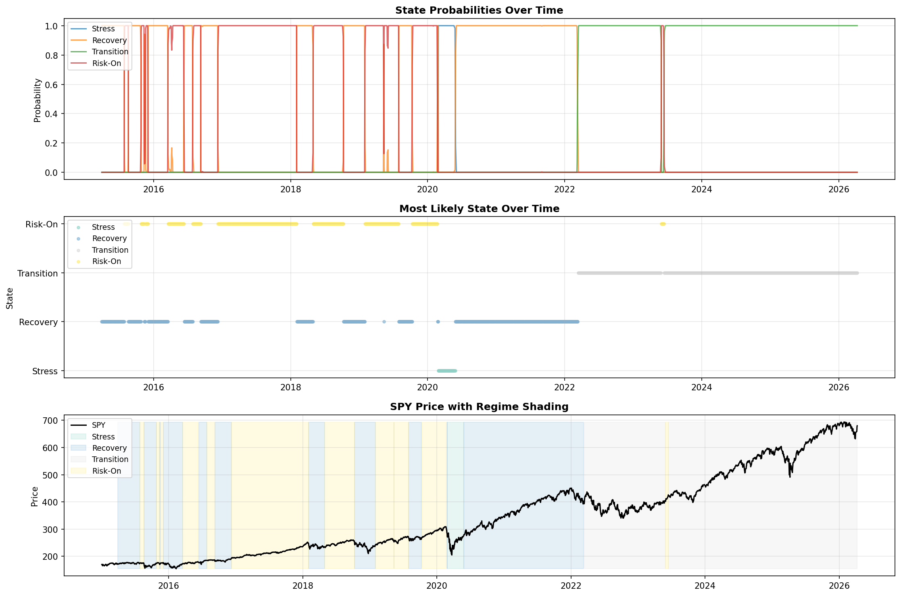
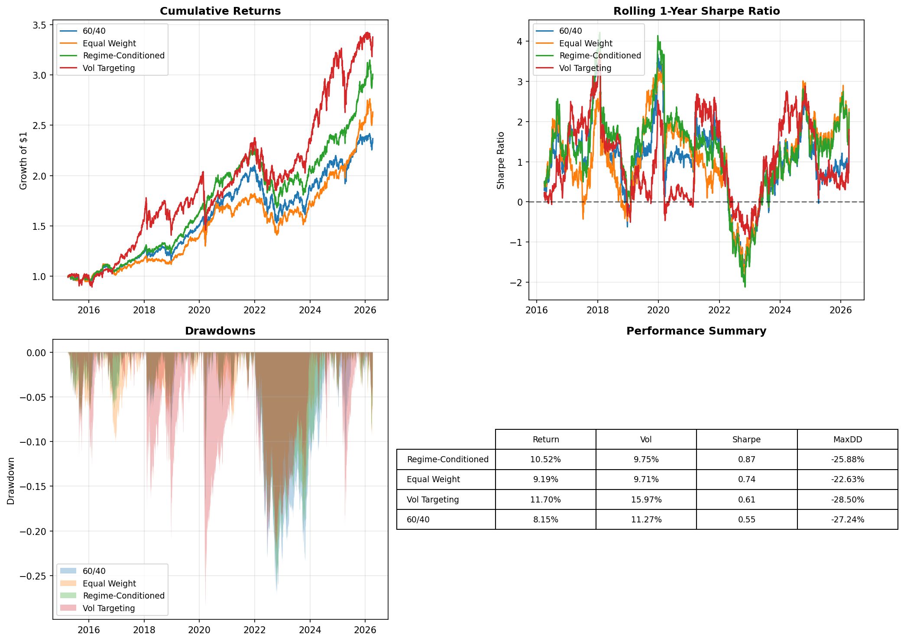
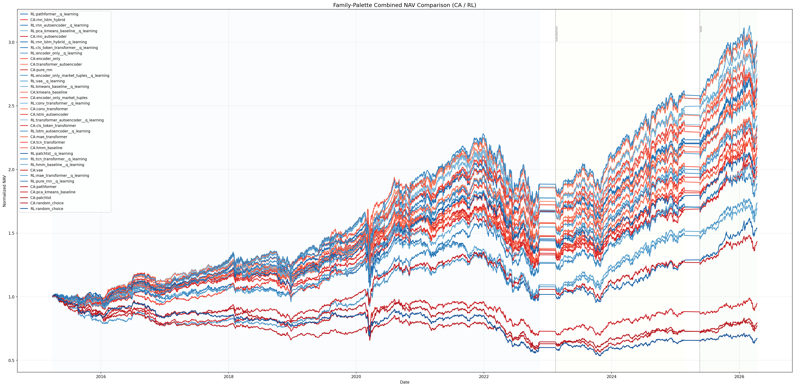

# Cross-Asset Regime Detection and Portfolio Optimization

**Language:** English | [中文](#chinese)

## English

### Overview

This repository studies **cross-asset market regime detection** and tests whether a regime-aware allocation rule can outperform static portfolios.

The project currently contains two research tracks:

- **Track A**: interpretable regime detection with a Gaussian HMM on hand-crafted macro-financial features
- **Track B**: representation learning and benchmarking on rolling windows, followed by portfolio backtests under both cluster-action search and RL policies

### What Is Implemented

- Free-data pipeline built from **Yahoo Finance**, **FRED**, and **Ken French**
- HMM feature engineering and BIC-based state selection
- Regime-conditioned portfolio backtest for the HMM track
- Track B benchmark suite with multiple architectures:
  - encoder-only Transformer
  - CLS-token Transformer
  - Conv/TCN/MAE Transformer variants
  - PatchTST- and Pathformer-inspired variants
  - RNN / hybrid / autoencoder baselines
  - classical clustering baselines
- Unified benchmark export for:
  - **CA**: validation-set cluster-to-action search, then fixed mapping on test
  - **RL**: Q-learning on model states/clusters
- Combined ranking tables, PNG charts, and GIF animations

### Repository Layout

```text
.
|-- feature_engineering.py
|-- hmm_regime_detection.py
|-- portfolio_strategy.py
|-- outputs/
|   |-- hmm_regime_detection.png
|   |-- strategy_comparison.csv
|   `-- strategy_comparison.png
`-- Final_Project/
    |-- data/
    `-- track_b/
        |-- architecture_comparison.ipynb
        |-- experiment_presets.py
        |-- cluster_action_backtest.py
        |-- rl_backtest_agent.py
        |-- run_cluster_action_rankings.py
        |-- run_rl_backtest_rankings.py
        |-- plot_combined_nav_comparison.py
        `-- results/
```

### Data

The current experiments use:

- **Yahoo Finance** market series: `SPY`, `TLT`, `GLD`, `UUP`, `HYG`, `LQD`, `^VIX`
- **FRED** macro series: treasury yields and related curve features
- **Ken French** factor data for auxiliary analysis

Core local datasets live under [Final_Project/data](Final_Project/data).

### Track A: HMM Results

Track A uses engineered cross-asset features such as returns, rolling volatility, rolling correlations, `VIX` level, and curve slope to fit a Gaussian HMM and label regimes as `Stress`, `Transition`, `Recovery`, and `Risk-On`.

#### Regime Detection Snapshot



#### Strategy Comparison



Current strategy metrics from [outputs/strategy_comparison.csv](outputs/strategy_comparison.csv):

| Strategy | Annual Return | Annual Volatility | Sharpe | Max Drawdown |
| --- | ---: | ---: | ---: | ---: |
| Regime-Conditioned | 10.52% | 9.75% | **0.874** | -25.88% |
| Equal Weight | 9.19% | 9.71% | 0.741 | -22.63% |
| Vol Targeting | 11.70% | 15.97% | 0.607 | -28.50% |
| 60/40 | 8.15% | 11.27% | 0.545 | -27.24% |

### Track B: Combined Benchmark Visuals

Track B compares **CA** and **RL** policy families:

- **CA** uses the model's clusters/states, searches the best cluster-to-action mapping on validation, then evaluates on test
- **RL** uses Q-learning on top of model states/clusters and backtests the learned policy

#### Full-Period Family-Palette Animation

- Red shades: **CA**
- Blue shades: **RL**


#### Test-Only Family-Palette Animation


#### Static Full-Period Comparison



### Overall Rank List

Current combined leaderboard (`K=4`) from [overall_model_leaderboard.csv](Final_Project/track_b/results/combined_nav_rankings_k4/overall_model_leaderboard.csv):

| Overall Rank | Model | Family | Validation Rank | Test Rank | Avg Rank | Validation Sharpe | Test Sharpe |
| ---: | --- | --- | ---: | ---: | ---: | ---: | ---: |
| 1 | `RL:encoder_only__q_learning` | RL | 1 | 1 | 1.0 | 1.744 | **1.403** |
| 2 | `CA:tcn_transformer` | CA | 2 | 3 | 2.5 | 1.676 | 1.140 |
| 3 | `RL:tcn_transformer__q_learning` | RL | 3 | 4 | 3.5 | 1.553 | 1.128 |
| 4 | `CA:transformer_autoencoder` | CA | 8 | 2 | 5.0 | 1.442 | 1.173 |
| 5 | `CA:mae_transformer` | CA | 4 | 11 | 7.5 | 1.523 | 0.917 |
| 6 | `RL:conv_transformer__q_learning` | RL | 6 | 12 | 9.0 | 1.463 | 0.914 |
| 7 | `CA:pure_rnn` | CA | 13 | 7 | 10.0 | 1.380 | 1.026 |
| 8 | `CA:conv_transformer` | CA | 7 | 13 | 10.0 | 1.445 | 0.881 |
| 9 | `CA:cls_token_transformer` | CA | 12 | 10 | 11.0 | 1.382 | 0.932 |
| 10 | `RL:pathformer__q_learning` | RL | 15 | 9 | 12.0 | 1.376 | 0.951 |

Full ranking files:

- [Combined validation ranking](Final_Project/track_b/results/combined_nav_rankings_k4/combined_validation_ranking.csv)
- [Combined test ranking](Final_Project/track_b/results/combined_nav_rankings_k4/combined_test_ranking.csv)
- [Overall leaderboard](Final_Project/track_b/results/combined_nav_rankings_k4/overall_model_leaderboard.csv)

### How to Reproduce

For Track B, the main experiment notebook is:

- [Final_Project/track_b/architecture_comparison.ipynb](Final_Project/track_b/architecture_comparison.ipynb)

Generated benchmark outputs are saved under:

- [CA results](Final_Project/track_b/results/cluster_action_rankings_k4)
- [RL results](Final_Project/track_b/results/rl_backtest_rankings_k4)
- [Combined results](Final_Project/track_b/results/combined_nav_rankings_k4)


## Track B Backtest (`track_b_backtest.py`)

### How to Run

Run from the `Final_Project/track_b/` directory:

#### Run a single model
```bash
python track_b_backtest.py --architectures encoder_only
````

#### Run multiple models

```bash
python track_b_backtest.py --architectures encoder_only tcn_transformer pure_rnn
```

#### Run all default models

```bash
python track_b_backtest.py
```

---

### Output Location

By default, results are saved to:

```text
Final_Project/artifacts/track_b_backtest_k{cluster_count}/
```

You can also specify a custom path:

```bash
python track_b_backtest.py --output-dir ../artifacts/my_run
```

---

### What Gets Saved

#### 1. Global Files (all models)

* `validation_ranking.csv`
  → model ranking based on validation performance

* `test_ranking.csv`
  → model ranking based on test performance

* `overall_ranking.csv`
  → combined ranking (validation + test)

* `action_library.csv`
  → portfolio weights for each action (e.g. defensive, aggressive)

---

#### 2. Per-Model Folder

Each model gets its own folder:

```text
{experiment_name}/
```

Inside:

* `summary.csv`
  → key metrics (validation / test / full period)

* `mapping_search.csv`
  → all tested `cluster -> action` mappings and their scores

* `daily_backtest.csv`
  → daily results:

  * cluster
  * action
  * return
  * turnover
  * NAV

* `target_weights.csv`
  → intended portfolio weights (before lag)

* `executed_weights.csv`
  → actual weights used in backtest

* `nav.png`
  → NAV curve for this model

---

#### 3. Plots (comparison)

Located in:

```text
plots/
```

* `full_period_nav.png`
  → NAV comparison over entire period

* `validation_nav.png`
  → NAV on validation set

* `test_nav.png`
  → NAV on test set

---

### Summary

This script:

* takes Track B cluster outputs
* maps clusters to portfolio actions
* searches the best mapping on validation
* evaluates on test
* saves rankings, metrics, weights, and NAV plots


---

<details>
<summary><strong>切换到中文版</strong></summary>

<a id="chinese"></a>

## 中文版

### 项目简介

这个项目研究的是 **跨资产市场状态识别** 与 **状态感知型资产配置**：

- **Track A**：用手工构造的宏观金融特征做 Gaussian HMM，识别 `Stress / Transition / Recovery / Risk-On`
- **Track B**：用多种时序模型学习窗口表示，再做回测比较

当前仓库已经实现：

- 免费数据管线：Yahoo Finance / FRED / Ken French
- HMM 特征工程与状态选择
- Track A 的状态识别与组合回测
- Track B 的多模型基准比较
- 两类回测家族：
  - **CA**：先在 validation 搜索 `cluster -> action` 最优映射，再到 test 固定评估
  - **RL**：在模型状态/聚类结果上训练 Q-learning 策略
- 总榜单、PNG 图、GIF 动图输出

### Track A 结果

#### HMM 状态识别图


#### 策略对比图


对应 [outputs/strategy_comparison.csv](outputs/strategy_comparison.csv) 的核心结果：

| 策略 | 年化收益 | 年化波动 | Sharpe | 最大回撤 |
| --- | ---: | ---: | ---: | ---: |
| Regime-Conditioned | 10.52% | 9.75% | **0.874** | -25.88% |
| Equal Weight | 9.19% | 9.71% | 0.741 | -22.63% |
| Vol Targeting | 11.70% | 15.97% | 0.607 | -28.50% |
| 60/40 | 8.15% | 11.27% | 0.545 | -27.24% |

### Track B 合并回测图

说明：

- 红色系：**CA**
- 蓝色系：**RL**

#### Full-period 动图


#### Test-only 动图


#### Full-period 静态图


### 总榜单

完整榜单见：

- [overall_model_leaderboard.csv](Final_Project/track_b/results/combined_nav_rankings_k4/overall_model_leaderboard.csv)

当前前 10 名如下：

| 总排名 | 模型 | 家族 | Validation Rank | Test Rank | 平均排名 | Validation Sharpe | Test Sharpe |
| ---: | --- | --- | ---: | ---: | ---: | ---: | ---: |
| 1 | `RL:encoder_only__q_learning` | RL | 1 | 1 | 1.0 | 1.744 | **1.403** |
| 2 | `CA:tcn_transformer` | CA | 2 | 3 | 2.5 | 1.676 | 1.140 |
| 3 | `RL:tcn_transformer__q_learning` | RL | 3 | 4 | 3.5 | 1.553 | 1.128 |
| 4 | `CA:transformer_autoencoder` | CA | 8 | 2 | 5.0 | 1.442 | 1.173 |
| 5 | `CA:mae_transformer` | CA | 4 | 11 | 7.5 | 1.523 | 0.917 |
| 6 | `RL:conv_transformer__q_learning` | RL | 6 | 12 | 9.0 | 1.463 | 0.914 |
| 7 | `CA:pure_rnn` | CA | 13 | 7 | 10.0 | 1.380 | 1.026 |
| 8 | `CA:conv_transformer` | CA | 7 | 13 | 10.0 | 1.445 | 0.881 |
| 9 | `CA:cls_token_transformer` | CA | 12 | 10 | 11.0 | 1.382 | 0.932 |
| 10 | `RL:pathformer__q_learning` | RL | 15 | 9 | 12.0 | 1.376 | 0.951 |

### 主要入口

- 主 notebook：
  [Final_Project/track_b/architecture_comparison.ipynb](Final_Project/track_b/architecture_comparison.ipynb)
- CA 结果目录：
  [cluster_action_rankings_k4](Final_Project/track_b/results/cluster_action_rankings_k4)
- RL 结果目录：
  [rl_backtest_rankings_k4](Final_Project/track_b/results/rl_backtest_rankings_k4)
- 合并结果目录：
  [combined_nav_rankings_k4](Final_Project/track_b/results/combined_nav_rankings_k4)

</details>
